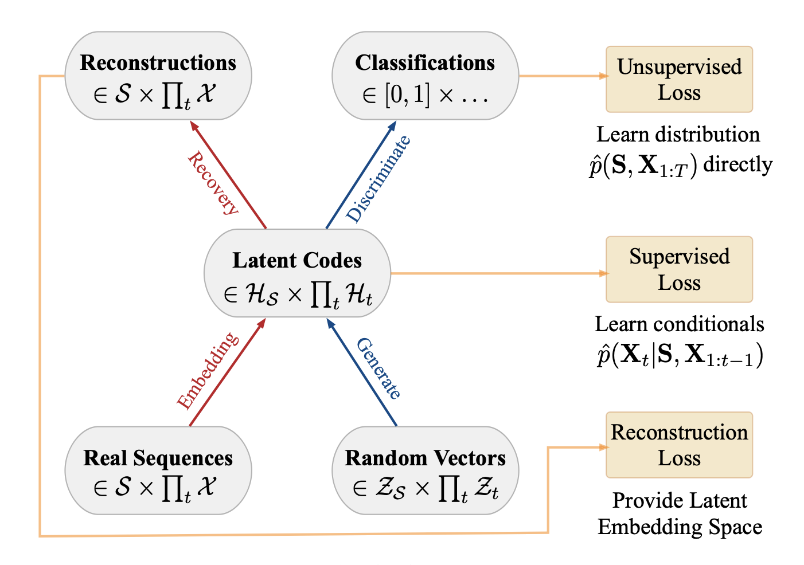
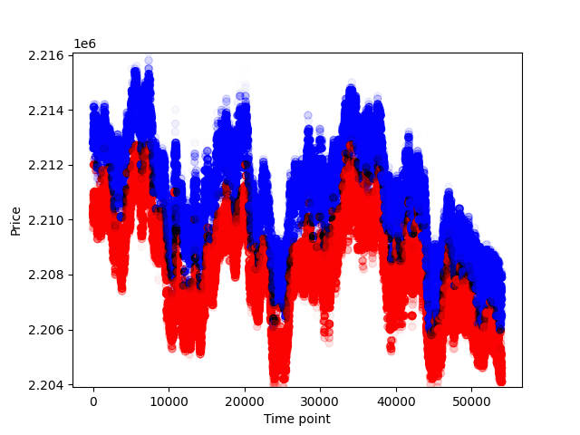
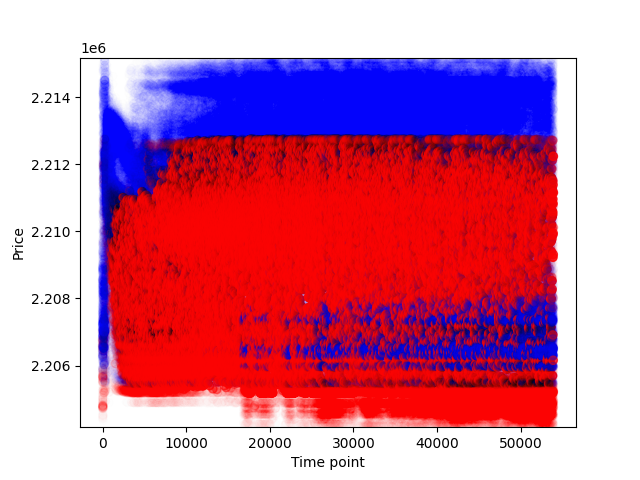
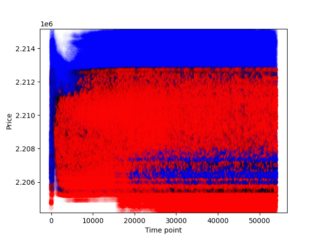

# Limit-order book TimeGAN project

Student name: Ian Pinto

Student ID: 48006581

For COMP3710 at The University of Queensland

# Project summary

I trained a TimeGAN model to generate synthetic book (LOB) data using AMZN level 10 data from the
[LOBSTER dataset](https://lobsterdata.com/info/DataSamples.php). I had the following metric goals:

- **Distribution similarity**: KL divergence ≤ 0.1 between the generated and real spread and
  midprice return distributions.
- **Visual similarity**: SSIM > 0.6 between heatmaps of generated vs real LOB depth snapshots.

# Instructions overview

1. Create a Python virtual environment and install the dependencies in `requirements.txt`
2. Download the [AMZN level 10 LOBSTER orderbook
   data](https://lobsterdata.com/info/sample/LOBSTER_SampleFile_AMZN_2012-06-21_10.zip) and put the
   `AMZN_2012-06-21_34200000_57600000_orderbook_10.csv` file in the `data` directory
3. Run `python train.py --env local` to train the model and save its weights
4. Run `python predict.py --env local` for model evaluation

# Project setup

See `requirements.txt` for a full list of Python libraries and versions. I used a Python virtual
environment, though a `conda` environment would work fine as well. I used Python version 3.13.7.
Ensure you activate the environment before running the Python scripts.

# Data

This project uses **AMZN (Amazon) level 10 limit order book data** -
[download link](https://lobsterdata.com/info/sample/LOBSTER_SampleFile_AMZN_2012-06-21_10.zip).  
See [this Investopedia article](https://www.investopedia.com/terms/l/limitorderbook.asp) for a more
detailed overview of what a limit order book is. However, the key information for this project is as
follows: a *level 10 limit order book* stores the highest price someone is willing to buy a stock
for (the *best bid*), the second-highest price someone is willing to buy a stock for, and so on to
the 10th best bid. It also stores the same for the lowest price someone is willing to sell a stok
for (the *best ask*), down to the 10th best ask. At any price, the volume (amount) of the stock that
someone is willing to buy/sell is stored.

The limit order book data file is called `AMZN_2012-06-21_34200000_57600000_orderbook_10.csv` and is
of the shape `(269748, 40)`. The first feature (column) is the best ask price, followed by the best
ask volume, then the best bid price, then the best bid volume, then the second-best bid price etc.
This file should go in the `data` directory. Change `ORDERBOOK_DATA_FILENAME` in `constants.py` if
you want to change the filename.

## Data processing

`numpy` (Python library) is used for most data processing.

From the `ReadMe` file provided with the LOBSTER data:

> Unoccupied Price Levels:
> When the selected number of levels exceeds the number of levels
> available the empty order book positions are filled with dummy
> information to guarantee a symmetric output. The extra bid
> and/or ask prices are set to -9999999999 and 9999999999,
> respectively. The Corresponding volumes are set to 0.

Given that the price values of ±9999999999 and the volume value of 0 are not genuine orderbook
entries, I didn't want the model to learn from these, so I removed any entry with a 0 value.

I used a 60-20-20 split for training, validation and testing, which is standard practice. The main
consideration here was having enough training data for the model to learn the statistical features
of the original data, while also having enough data so that the spread and midprice return
distributions of the test data match that of the entire dataset. I compared these distributions
manually by plotting them (~54,000 tuples of test data vs the original entire dataset, spread and
midprice return) and I believe they were sufficiently similar.

The training data is also sliced into windows of 24 rows (`seq_len` in `options.py`). These windows are then shuffled randomly.
This is to ensure that the windows are roughly independent and identically distributed, so that the
model can learn local statistical patterns rather than being overloaded by trying to reason about
the entire dataset.

# TimeGAN model

- Trained on UQ's Rangpur cluster which uses A100 GPUs
- VRAM: 40 GB
- 30,000 epochs are run in total. This number turned out to allow the entirety of the training to
  complete without timing out on Rangpur

## Parameter counts

- Parameters for Embedder: 12552
- Parameters for Recovery (Decoder): 29240
- Parameters for Generator: 12552
- Parameters for Supervisor: 11400
- Parameters for Discriminator: 11400

The code was largely taken from [TimeGAN-pytorch](https://github.com/zwzhang123/TimeGAN-pytorch?tab=readme-ov-file).
This TimeGAN model has the following components:



## Encoder

Converts the original (batched) stock data to a latent vector representation.

```
Batched stock data (normalised) -> GRU -> Linear FC layer -> Sigmoid activation function -> Latent representation
```

A gated recurrent unit (GRU) is a type of recurrent neural network that uses gating mechanisms to
manage the flow of sequential information, in this case sequential data. There is a lot of stock
data in this case (several hundreds of thousands of rows), but in this case, the *reset gate* and
the *update gate* of the GRU allow it to selectively remember and forget past information, making
the learning process much more efficient.
[Source](https://en.wikipedia.org/wiki/Gated_recurrent_unit)

## Recovery (decoder)

Does the opposite of the encoder.

```
Latent vector -> GRU -> Linear FC layer -> Sigmoid activation function -> Stock data windows (normalised)
```

The output of the decoder has to be denormalised to resemble the original stock data (linearly
scaled from [0, 1] to [feature min value, feature max value]).

## Generator

The generator converts random noise into a synthetic sequence in the latent space. In this
implementation, the noise is sampled from a uniform distribution, but a Gaussian distribution can
also be used.

```
Random noise -> GRU -> Linear FC layer -> Sigmoid activation -> Latent vector output
```

## Discriminator

The discriminator converts latent vectors into classifications in the range [0, 1], indicating real
or fake data.

```
Latent vector -> GRU -> Linear FC layer -> Sigmoid activation -> Classification
```

## Supervisor

There are two types of loss used for training:
- *Unsupervised* loss, where the discriminator is trained to identify real vs fake stock data as
  accurately as possible, and the generator is trained to try to 'fool' the discriminator
- *Supervised* loss, where the generator receives sequences of embeddings from real data and learns
  the probability distribution of the next data given a sequence of previous data. This is managed
  by the supervisor.

## Training

See `modules.TimeGAN.train_and_save`. The model is trained in full (i.e. both supervised and
unsupervised training). The training is as follows:

- Train the encoder and decoder together for N interations
- Train the supervisor for N iterations
- Train the generator, encoder/decoder and discriminator (unsupervised) for N iterations

# Metrics

## KL divergence of spread

*Spread* is the difference between the best bid and the best ask.

Achieved KL from spread distribution: 80.35599233840904

Target KL from spread distribution: ≤ 0.1

## KL divergence of midprice return

The midprice is the average of the best bid and the best ask, and gives an approximate measure of the value of a
stock at any point in time.

Achieved KL mid-price return from mid-price return distribution: 9.850393352517815e-05

Target KL mid-price return from mid-price return distribution: ≤ 0.1

## Heatmaps

Heatmaps visualise the distribution of volumes and prices for bids/asks in an order book. For these
heatmaps, bids are blue (because alliteration) and asks are red.

SSIM (measure of image similarity) was used to compare the heatmaps from the synthetic vs real stock
data.

Target SSIM: ≥ 0.6

Achieved SSIM: 0.681, 0.678, 0.675

Heatmap of test data:



Synthetic heatmap 1:



Synthetic heatmap 2:


Synthetic heatmap 3:



# Strengths and weaknesses of synthetic LOB

This TimeGAN model is best at mimicking small windows of the original stock data. However, from my
testing, it failed to resemble the original data for longer synthetic sequences, i.e. failed to
resemble long-term patterns.

Volatility is a measure of sharply a stock's price varies over a period of time. Plotting volatility
over time, you should be able to see a *base volatility* with occasional spikes upward from that
base volatility. However, I didn't see this with the synthetic data.

# Potential future improvements

- Better reconstruction of 2D synthetic stock data (N x 40) from 3D model output of synthetic
  windows of data (N x 24 x 40)

# References
- [*What Is a Limit Order Book? Definition and Data* by Will Kenton (Investopedia article)](https://www.investopedia.com/terms/l/limitorderbook.asp)
- [*Time-series Generative Adversarial Networks* by Jinsung Yoon, Daniel Jarrett, Mihaela van der Schaar](https://papers.nips.cc/paper_files/paper/2019/file/c9efe5f26cd17ba6216bbe2a7d26d490-Paper.pdf)